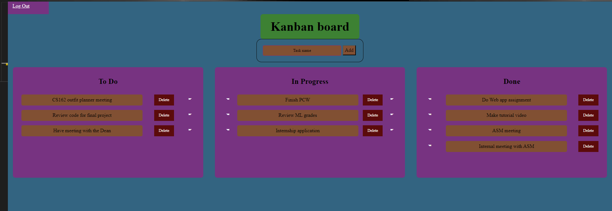
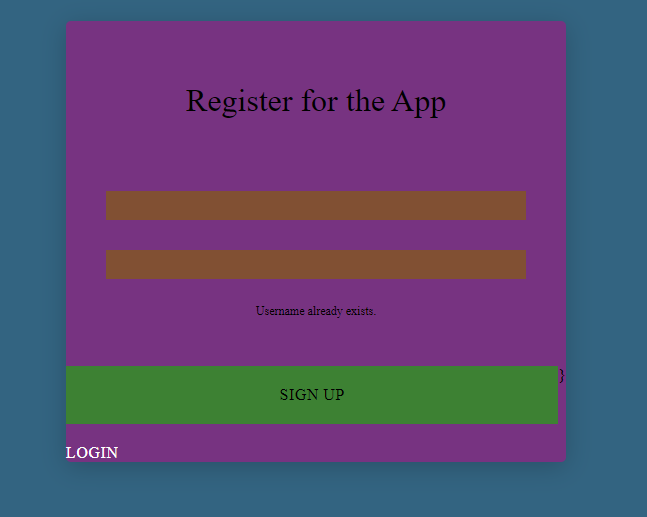
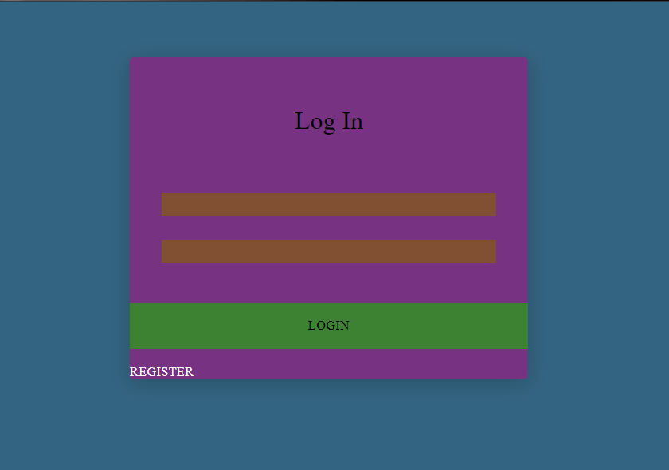

# Abdullah's Kanban Board

## Description

This is my first attempt at making a web application. For this, I have made a Kanban board which includes three columns - To Do, Doing, Done. The user can add tasks to the To Do column and move them to the Doing column and then to the Done column. The user can also delete tasks from the board.
Moreover, the Kanban board has multiple user functionality as well backed by a database. The user can create an account and then log in to the board. Tasks are stored using a foreign key referring to user ids in the table. Passwords are hashed using the bcrypt library so that they are not stored in plain text.

## Usage

After cloning the repository, run the following commands in the terminal:

```bash
python3 -m venv venv
venv\Scripts\activate.bat
pip3 install -r requirements.txt
python3 app.py
```

## Tutorial

[Loom Video](https://www.loom.com/share/01142e634b514f9196ab6caec4ddc8bd)  
[YouTube Video](https://youtu.be/CFhFejBpvyA)

## Some Screenshots




